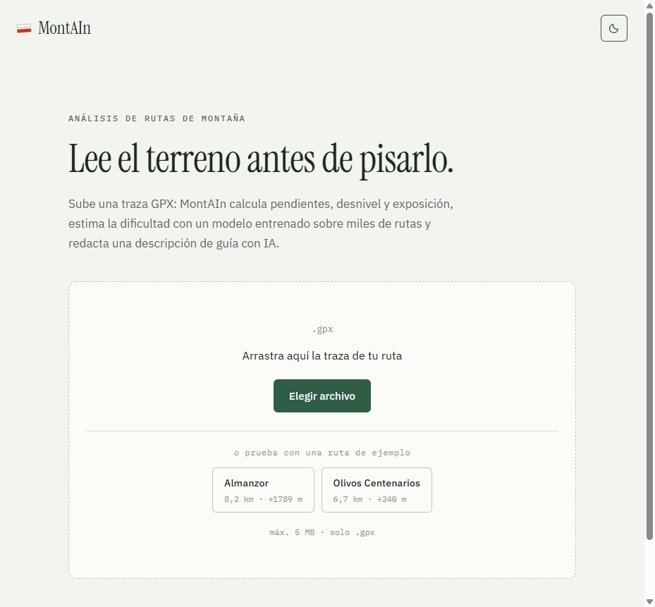

# MontAIn

Subes la traza GPX de una ruta de montaña y MontAIn te devuelve una ficha: métricas
del recorrido, mapa, perfil de elevación, una estimación de dificultad hecha por un
modelo entrenado sobre rutas de OpenStreetMap y una descripción escrita por Claude.



## La ficha de ruta

El color codifica datos en vez de decorar. En el perfil de elevación el relleno toma
el color de la altitud, como las tintas hipsométricas de un mapa topográfico: esta
ruta al Almanzor arranca en el verde de los 1193 m y termina en el gris de roca de
los 2523 m. Dos rutas a distinta cota se distinguen antes de leer una sola cifra.


## Cómo funciona

Una petición a `POST /process-gpx` recorre este camino:

| Paso | Qué hace |
|---|---|
| Validación | Extensión, tamaño y número de puntos de la traza |
| Elevación | Rellena las cotas que falten con datos SRTM |
| Features | Distancia geodésica, pendientes, rugosidad, exposición y orientación por tramo |
| Dificultad | Un XGBoost de regresión sobre 13 features, redondeado a seis grados ordinales |
| Mapa | Folium sobre OpenStreetMap, servido en un iframe con sandbox |
| Descripción | Claude redacta una guía a partir de las features, los eventos del recorrido y los momentos clave |

La descripción es opcional: sin `ANTHROPIC_API_KEY` el análisis funciona igual y el
campo `description` viene a `null`.

## Sobre la estimación de dificultad

El modelo se entrena con etiquetas que genera `classify_difficulty()`, un sistema de
reglas escrito a mano. Es decir, **aprende a reproducir esa heurística**, no a predecir
la dificultad real: sus métricas miden fidelidad a las reglas, no acierto. Se nota en
los falsos positivos —hay paseos suaves que salen como "difícil"— y corregirlo pasa por
reetiquetar el dataset con criterio humano o con una fuente externa. Úsalo como una
orientación, no como un grado oficial.

## Puesta en marcha

Requiere Python 3.11 y Node 20.

### API

```bash
python -m venv .venv
source .venv/bin/activate        # Windows: .venv\Scripts\activate
pip install -r requirements.txt
cp .env.example .env             # opcional: rellena ANTHROPIC_API_KEY
python main.py
```

En `http://localhost:8000/docs` está la documentación interactiva.

### Frontend

```bash
cd front
pnpm install
pnpm dev
```

En `http://localhost:4321`. Si la API no está en `localhost:8000`, define
`PUBLIC_API_URL` en `front/.env` (ver `front/.env.example`).

## Configuración

Todo tiene un valor por defecto pensado para desarrollo, así que la API arranca sin
configurar nada. En producción se sobreescribe desde el panel del proveedor.

| Variable | Por defecto | Para qué |
|---|---|---|
| `ANTHROPIC_API_KEY` | — | Sin ella no se generan descripciones |
| `ANTHROPIC_MODEL` | `claude-sonnet-5` | Modelo que redacta la descripción |
| `CORS_ORIGINS` | localhost | Dominios que pueden llamar a la API |
| `MAX_UPLOAD_BYTES` | 5 MB | Tamaño máximo del GPX |
| `MAX_TRACK_POINTS` | 50 000 | Puntos máximos de la traza |
| `RATE_LIMIT_REQUESTS` | 10 / hora | Peticiones por IP |
| `ANALYSIS_CACHE_SIZE` | 128 | Resultados cacheados por hash del archivo |
| `SRTM_CACHE_DIR` | `.srtm-cache` | Dónde se guardan los tiles de elevación |

Lista completa en [`.env.example`](.env.example).

## Despliegue

La API va en un contenedor ([`Dockerfile`](Dockerfile)) y el frontend en Vercel con
`front/` como raíz.

```bash
docker build -t montain-api .
docker run -p 8000:8000 -e ANTHROPIC_API_KEY=... montain-api
```

[`render.yaml`](render.yaml) despliega la API en Render con un disco persistente para
los tiles SRTM. Sin ese disco, cada arranque en frío vuelve a descargarlos y la primera
petición se dispara.

## Entrenamiento

El modelo desplegado (`xgboost_regresion.json`) ya está en el repositorio. Para
regenerarlo:

```bash
pip install -r training/requirements.txt

python -m training.train fetch --region pirineos
python -m training.train dataset --out bigDataset.csv
python -m training.train train --model xgboost-reg --save xgboost_regresion.json
```

Hay cuatro modelos comparables (`baseline`, `xgboost`, `xgboost-reg`, `nn`) en
[`training/models/`](training/models/).

## Estructura

```
main.py              API FastAPI
config.py            Configuración por variables de entorno
datasetter.py        Features del recorrido y estimación de dificultad
api/                 Mapa, rate limiting y caché
description/         Pipeline de la descripción con IA
GPX_uses/, Fetch/    Carga de GPX y descarga desde OpenStreetMap
training/            Pipeline de entrenamiento
front/               Frontend Astro + React
integrations/n8n/    Workflow que publica la ficha en WordPress
```

## Stack

FastAPI · XGBoost · pandas · Folium · SRTM · Astro · React · Claude

## Licencia

[MIT](LICENSE)
