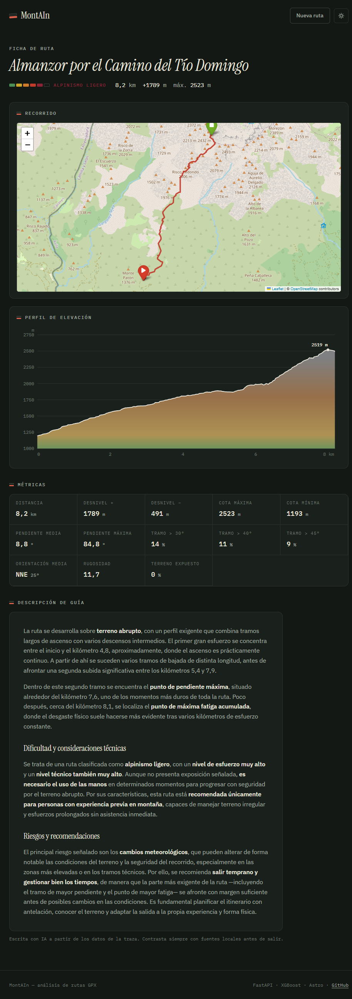

# MontAIn

Analiza rutas de montaña. Subes una traza GPX y devuelve las métricas del
recorrido, el mapa, el perfil de elevación, una estimación de la dificultad y
una descripción escrita con IA.



## Cómo funciona

Cuando subes un GPX, el backend lo recorre en cuatro pasos:

1. **Lee la traza** y completa con datos SRTM las altitudes que falten, porque
   muchos GPX vienen sin ellas o con ceros.
2. **Calcula las features** del recorrido punto a punto: distancia geodésica,
   pendientes, desnivel acumulado, rugosidad del terreno, exposición y
   orientación.
3. **Estima la dificultad** con un modelo XGBoost entrenado sobre rutas de
   OpenStreetMap, que devuelve uno de seis grados, de sendero fácil a alpinismo
   técnico.
4. **Redacta la descripción** pasándole a Claude las features junto con los
   momentos clave detectados en la ruta: dónde está la pendiente máxima, dónde
   se acumula la fatiga, qué tramos son de subida sostenida.

El frontend lo presenta como una ficha de ruta. En el perfil de elevación el
color no decora: es la altitud, con las mismas tintas hipsométricas que usa un
mapa topográfico.

> El modelo aprende de etiquetas generadas por un sistema de reglas, así que
> reproduce esa heurística en lugar de la dificultad real. Tómalo como una
> orientación, no como un grado oficial.

## Cómo usarlo

Necesitas Python 3.11 y Node 20.

**1. Clona el repositorio y prepara el entorno:**

```bash
git clone https://github.com/naiik21/MontAIn.git
cd MontAIn

python -m venv .venv
source .venv/bin/activate          # Windows: .venv\Scripts\activate
pip install -r requirements.txt
```

**2. Pruébalo sin más:**

```bash
python analyze_gpx.py front/public/ejemplos/almanzor.gpx
```

**3. O levanta la aplicación completa.** La API:

```bash
cp .env.example .env               # Windows: copy .env.example .env
python main.py
```

Y el frontend, en otra terminal:

```bash
cd front
pnpm install
pnpm dev
```

Abre `http://localhost:4321`.

Para que genere descripciones, pon tu clave de
[console.anthropic.com](https://console.anthropic.com) en el `.env`. Sin ella
todo lo demás funciona igual.

## Stack

FastAPI · XGBoost · pandas · Folium · SRTM · Astro · React · Claude

## Licencia

[MIT](LICENSE)
